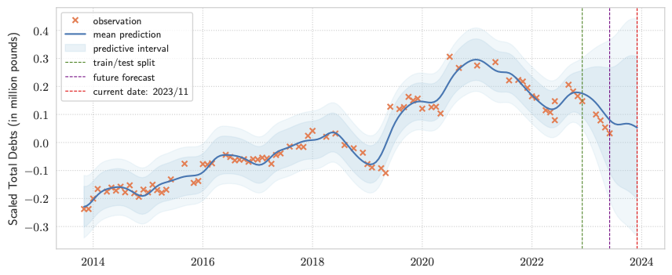

SME
==============================

Analysing the borrowing history of a small business with `Gaussian Process`.

## on predictive modelling
Gaussian process model is adopted in this analysis for three reasons:
(i) it accounts for the model uncertainty; 
(ii) it is efficient to compute on a small data set with analytic solution; 
(iii) it naturally deals with missing data;

## on documents

Two documents, as listed below, are demonstrated:

1. A [Jupyter notebook file](https://nbviewer.org/github/leslieDLcy/SME/blob/main/notebooks/SME_assignment_byYuChen.ipynb#) as a one-stop solution containing code and explanation. It can be better viewed via `nbviewer` at [this address](https://nbviewer.org/github/leslieDLcy/SME/blob/main/notebooks/SME_assignment_byYuChen.ipynb#). The original `.ipynb` file is stored in this repository [here](notebooks/SME_assignment_byYuChen.ipynb).

2. A PDF report clearly summarizing the procedures and futher thoughts on Machine Learning strategies that can deliver more possibilities for this assignment. 

## on organising the code

Throughout this analysis, I meant to write library codes that can serve as recipes, for instance, to solve a certain data problem, create a model, generate a figure, etc. Most importantly, these library codes can be re-used by others (e.g. team members or clients) later on, as in being adopted in user code. Notably, these library codes can be easily packaged into a Python package, facilitating the sharing and usage by others

## on processing data

> Python functions are written as recipes to solve a respective data problem. Most importanly, these functions can be chaining together using Pandas's **chaining** mechanism.

> As such, a one-stop function can be created, by chaining, to process the raw data and then save the cleaned data into the `/data/processed` directory.

> Later on, modellers can directly import this processed clean dataset from disk, saving the trouble for processing data each time.

## on data visualisation

Check out the [visualization directory](visualization) for the figures generated.

--------

